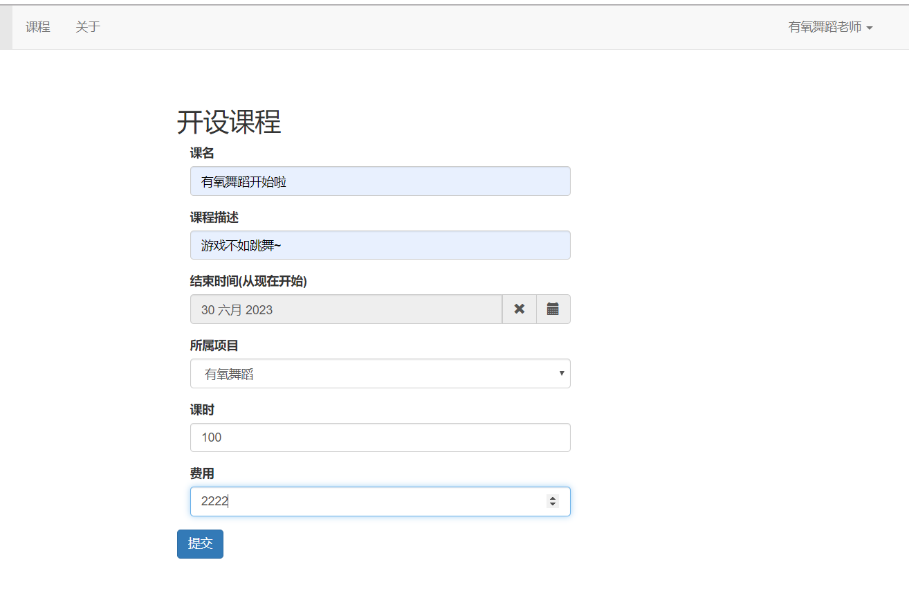
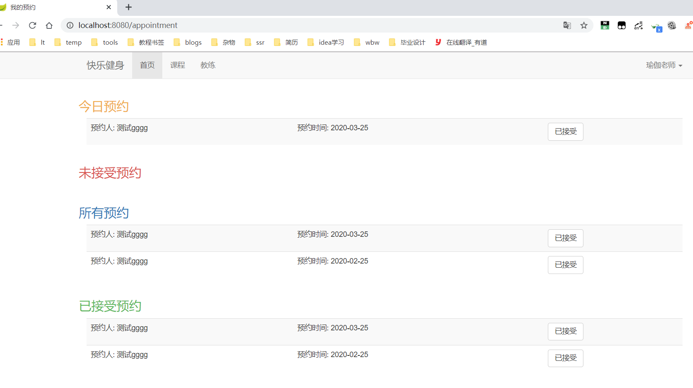

# 健身信息系统

### 技术栈
- SpringBoot 
- Mybatis
- Thymeleaf
- 数据库:mysql

其他工具:**mybatis-gernarate** Maven插件

### 系统功能:
- 用户选课
- 老师开课
- 管理员功能

### 系统预览
- index

- courses

- addCourse

- manager

- yuyue

